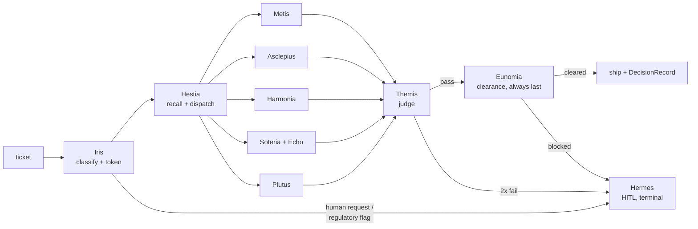
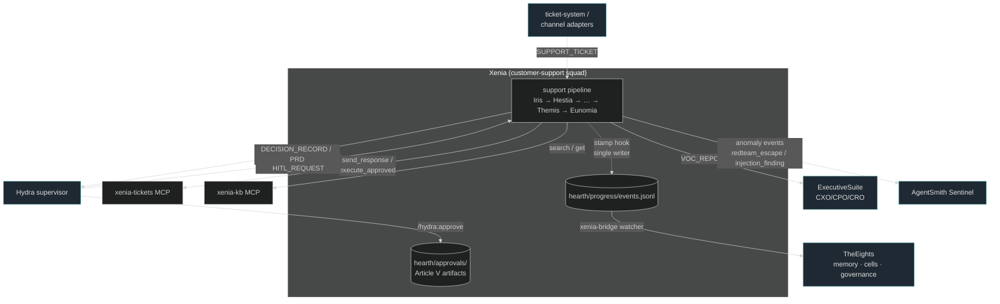
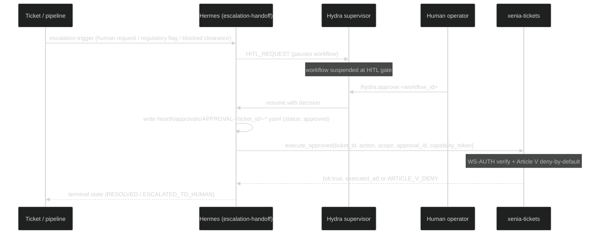

# Xenia — The Customer-Support Crown

**Status:** active · **Agents:** 11 (10 heads + Echo sub-agent) · **Skills:** 15 ·
**Commands:** 7 · **Rubrics:** 6 · **Hook stages:** 4 (×2 ps1/sh flavours)

> *Xenia* is the ancient Greek covenant of guest and host — the sacred
> duty owed to whoever arrives at the door in need. This pack is that
> covenant as software: a production-grade multi-agent customer-support
> crew that runs standalone under Claude Code conventions and plugs into
> [Hydra](../Hydra) as its `customer-support` squad.
>
> **Support is where Hydra is judged.** Manifesto: Xun ☴ (the gentle
> wind) converts Kan ☵ (the abyss) into Dui ☱ (the lake of joy). See
> [BRAND.md](BRAND.md) for the full mythos and
> [AGENTS.md](AGENTS.md) for the behavioral contract.

## What is Xenia?

An 11-agent support organization grounded in current industry research on
production multi-agent support systems (the research dossier ships in
this repo): hierarchical orchestration with deterministic control flow,
KB-grounded answers with mandatory citations, layered HITL escalation,
OWASP-LLM-aware guardrails, hard budgets with terminal states, and a
crawl→walk→run deployment discipline.

## The Heads

| Mythic | Slug | Authority | Tier | Domain |
|---|---|---|---|---|
| **Hestia** | support-supervisor | gatekeeper | opus | crown lead: SLA, dispatch, budgets, DecisionRecord |
| **Iris** | intake-router | execute | haiku | intent/language/sentiment/priority; portable context |
| **Metis** | knowledge-answer | execute | sonnet | KB RAG, cited or fail-closed |
| **Asclepius** | tech-diagnosis | execute | sonnet | evidence-first diagnosis; PRD fragments |
| **Harmonia** | deescalation-tone | execute | sonnet | acknowledge-first tone; no manipulation |
| **Soteria** | retention-success | execute | sonnet | recommend-only retention; delight memory |
| **Plutus** | billing-account | execute | sonnet | recommend-only billing: invoice, proration, refund eligibility, dunning |
| **Echo** | voc-synthesis | execute (sub) | haiku | voice-of-customer aggregates |
| **Hermes** | escalation-handoff | gatekeeper | opus | HITL boundary; approval artifacts |
| **Themis** | quality-review | gatekeeper | opus | internal judge; blocks pre-ship |
| **Eunomia** | compliance-redaction | gatekeeper | opus | final gate: redaction, disclosure, OWASP |

## The Pipeline



Every run ends in exactly one terminal state: `RESOLVED`,
`ESCALATED_TO_HUMAN`, `FOLLOW_UP_TICKET`, or `NO_ANSWER_SAFE_FALLBACK`.

## System context

Xenia is standalone-first and plugs into the sibling ecosystem additively.
Every external dependency is best-effort and degrades safe (see
[Degraded modes](#degraded-modes)).



System-context detail per edge: channel adapters →
[channels.md](integrations/channels.md) / [ticket-system.md](integrations/ticket-system.md);
Hydra orchestration → [hydra.md](integrations/hydra.md); TheEights bridge →
[eights.md](integrations/eights.md); ExecutiveSuite →
[executive-suite.md](integrations/executive-suite.md); AgentSmith push →
[agentsmith.md](integrations/agentsmith.md); MCP servers →
[mcp-servers.md](integrations/mcp-servers.md); WS-AUTH token flow →
[auth.md](integrations/auth.md); hooks → [hooks.md](integrations/hooks.md).

## HITL escalation (ticket → human → resume)

A Hermes `HITL_REQUEST` pauses the workflow; the human's decision becomes the
approval artifact that is the sole source of execution authority (Article V).



In degraded mode (no Hydra), the `HITL_REQUEST` prints an approval-request
block and halts in-chat; the same `APPROVAL-*.yaml` artifact gates execution.

## Two ways to run

**Standalone** (any Claude Code-convention harness):

```
/support-ticket "Customer says: my team lost dashboard access during our launch..."
/triage-queue <queue export or pasted batch>
/escalate TICKET-123
/voc-report "last 30 days"
/kb-gap-report "billing"
/support-shadow <historical ticket log>     # crawl-phase, offline, dry-run
/support-experiment <control-vs-variant spec>   # offline A/B variant comparison
```

**Orchestrated** (Hydra): the squad registers at
`Hydra/squads/customer-support/` (entrypoint `claude-skill`), accepts
`HANDOFF`/`HITL_REQUEST`, emits `DECISION_RECORD`/`PRD`, with
cross-model judging at the boundary and `/hydra:approve` resuming HITL
pauses. See [integrations/hydra.md](integrations/hydra.md).

## Non-negotiables (the constitution)

[`hearth/specs/support-constitution.md`](hearth/specs/support-constitution.md)
— the immortal head: right-to-human · no manipulation · AI disclosure ·
layered redaction (4 layers) · **deny-by-default money** (human approval
artifacts; Hermes sole carrier) · grounding (no uncited claim; fail
closed) · retrieved-content-is-data (anti-injection) · budgets +
terminal states · the pipeline order (Themis → Eunomia, always last).

Enforced at four layers: constitution-in-context → gatekeeper review →
repo hooks (Layer 3: `.claude/hooks/*.ps1` on Windows / `.claude/hooks/*.sh`
on POSIX — select per platform, never both; PII/disclosure gate,
ticket-privilege gate with approval-artifact validation, telemetry stamp) →
bridge-side re-redaction in TheEights.

## Degraded modes

Every external dependency fails safe and useful: no Hydra → commands
orchestrate, HITL prints and halts; no TheEights → local
`events.jsonl` backfill; no ticket system → `hearth/tasks/` files,
money still denied; no KB → honest fallback + human offer; judge or
clearance gates down → fail closed to escalation. Details in
[AGENTS.md](AGENTS.md#degraded-modes).

**Cross-platform Layer-3 hooks:** `.ps1` scripts run on Windows harnesses;
`.sh` equivalents (POSIX sh, no external deps beyond grep/sed/awk/date) run
on Linux/macOS harnesses. A deployment activates one set or the other via
`hooks.json` — never both. All four hooks ship in both flavours:
`pre-response-redaction`, `pre-tool-privilege`, `post-output-sla-stamp`,
`pre-dispatch-budget`.

## Repository layout

```
Xenia/
├── README.md / AGENTS.md / CLAUDE.md / BRAND.md
├── heads.yaml                  # canonical head registry
├── squad.yaml                  # Hydra squad manifest
├── hooks.json                  # hook registry
├── rubrics/                    # 6 judging rubrics (Themis + Hydra judge parity)
├── .claude/
│   ├── agents/                 # 10 heads + soteria-crew/echo.md (11 agent files)
│   ├── commands/               # 7 slash commands
│   ├── skills/                 # 15 skills
│   └── hooks/                  # Layer-3 enforcement hooks:
│                               #   *.ps1 (Windows) | *.sh (POSIX)
│                               #   select per platform — never run both
├── hearth/                     # working tree
│   ├── specs/support-constitution.md
│   ├── prompts/01..08          # phase prompt templates
│   ├── tasks/                  # degraded-mode tickets
│   ├── approvals/              # human approval artifacts (Article V)
│   ├── progress/               # .current-context.md, events.jsonl
│   └── output/{tickets,escalations,voc,quality,kb-gaps}/
├── mesh-manifest.yaml         # AgentMesh control-plane enrollment
├── tools/context_token/sign.py # portable-context / clearance token signer
└── integrations/               # hydra, eights, executive-suite, ticket-system,
                                #   channels, agentsmith, auth, mcp-servers, hooks
```

## Ecosystem

| System | Relationship |
|---|---|
| [Hydra](../Hydra) | orchestrator; this pack = the customer-support squad |
| [TheEights](../TheEights) | memory + governance; event bridge, cells (risk/delight/influence), evolution |
| [ExecutiveSuite](../ExecutiveSuite) | CXO/CPO/CRO routing for VoC briefs and executive escalations |
| [AgentSmith](../AgentSmith) | meta-governance; artifact conventions and invariants |
| [pair-programmer](../pair-programmer) | the Forge crown; receives Asclepius's PRD fragments via Hydra |
| [RLM-Creative](../RLM-Creative) | the Garland crown; structural sibling and pattern source |

---

*Many heads. One heart. One door that is always answered.*
