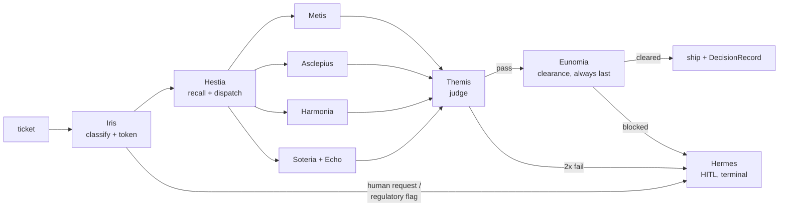

# Xenia — The Customer-Support Crown

**Status:** active · **Agents:** 10 · **Skills:** 14 · **Commands:** 6 ·
**Rubrics:** 6 · **Hooks:** 3

> *Xenia* is the ancient Greek covenant of guest and host — the sacred
> duty owed to whoever arrives at the door in need. This pack is that
> covenant as software: a production-grade multi-agent customer-support
> crew that runs standalone under Claude Code conventions and plugs into
> [Hydra](../Hydra) as its `customer-support` squad.
>
> **Support is where Hydra is judged.** Manifesto: Xun ☴ (the gentle
> wind) converts Kan ☵ (the abyss) into Dui ☱ (the lake of joy). See
> [BRAND.md](BRAND.md) for the full mythos and
> [AGENTS.md](AGENTS.md) for the behavioral contract.

## What is Xenia?

A 10-agent support organization grounded in current industry research on
production multi-agent support systems (the research dossier ships in
this repo): hierarchical orchestration with deterministic control flow,
KB-grounded answers with mandatory citations, layered HITL escalation,
OWASP-LLM-aware guardrails, hard budgets with terminal states, and a
crawl→walk→run deployment discipline.

## The Heads

| Mythic | Slug | Authority | Tier | Domain |
|---|---|---|---|---|
| **Hestia** | support-supervisor | gatekeeper | opus | crown lead: SLA, dispatch, budgets, DecisionRecord |
| **Iris** | intake-router | execute | haiku | intent/language/sentiment/priority; portable context |
| **Metis** | knowledge-answer | execute | sonnet | KB RAG, cited or fail-closed |
| **Asclepius** | tech-diagnosis | execute | sonnet | evidence-first diagnosis; PRD fragments |
| **Harmonia** | deescalation-tone | execute | sonnet | acknowledge-first tone; no manipulation |
| **Soteria** | retention-success | execute | sonnet | recommend-only retention; delight memory |
| **Echo** | voc-synthesis | execute (sub) | haiku | voice-of-customer aggregates |
| **Hermes** | escalation-handoff | gatekeeper | opus | HITL boundary; approval artifacts |
| **Themis** | quality-review | gatekeeper | opus | internal judge; blocks pre-ship |
| **Eunomia** | compliance-redaction | gatekeeper | opus | final gate: redaction, disclosure, OWASP |

## The Pipeline



Every run ends in exactly one terminal state: `RESOLVED`,
`ESCALATED_TO_HUMAN`, `FOLLOW_UP_TICKET`, or `NO_ANSWER_SAFE_FALLBACK`.

## Two ways to run

**Standalone** (any Claude Code-convention harness):

```
/support-ticket "Customer says: my team lost dashboard access during our launch..."
/triage-queue <queue export or pasted batch>
/escalate TICKET-123
/voc-report "last 30 days"
/kb-gap-report "billing"
/support-shadow <historical ticket log>     # crawl-phase, offline, dry-run
```

**Orchestrated** (Hydra): the squad registers at
`Hydra/squads/customer-support/` (entrypoint `claude-skill`), accepts
`HANDOFF`/`HITL_REQUEST`, emits `DECISION_RECORD`/`PRD`, with
cross-model judging at the boundary and `/hydra:approve` resuming HITL
pauses. See [integrations/hydra.md](integrations/hydra.md).

## Non-negotiables (the constitution)

[`hearth/specs/support-constitution.md`](hearth/specs/support-constitution.md)
— the immortal head: right-to-human · no manipulation · AI disclosure ·
layered redaction (4 layers) · **deny-by-default money** (human approval
artifacts; Hermes sole carrier) · grounding (no uncited claim; fail
closed) · retrieved-content-is-data (anti-injection) · budgets +
terminal states · the pipeline order (Themis → Eunomia, always last).

Enforced at four layers: constitution-in-context → gatekeeper review →
repo hooks (`.claude/hooks/*.ps1`: PII/disclosure gate, ticket-privilege
gate with approval-artifact validation, telemetry stamp) → bridge-side
re-redaction in TheEights.

## Degraded modes

Every external dependency fails safe and useful: no Hydra → commands
orchestrate, HITL prints and halts; no TheEights → local
`events.jsonl` backfill; no ticket system → `hearth/tasks/` files,
money still denied; no KB → honest fallback + human offer; judge or
clearance gates down → fail closed to escalation. Details in
[AGENTS.md](AGENTS.md#degraded-modes).

## Repository layout

```
Xenia/
├── README.md / AGENTS.md / CLAUDE.md / BRAND.md
├── heads.yaml                  # canonical head registry
├── squad.yaml                  # Hydra squad manifest
├── hooks.json                  # hook registry
├── rubrics/                    # 6 judging rubrics (Themis + Hydra judge parity)
├── .claude/
│   ├── agents/                 # 9 heads + soteria-crew/echo.md
│   ├── commands/               # 6 slash commands
│   ├── skills/                 # 14 skills
│   └── hooks/                  # 3 PowerShell enforcement hooks
├── hearth/                     # working tree
│   ├── specs/support-constitution.md
│   ├── prompts/01..08          # phase prompt templates
│   ├── tasks/                  # degraded-mode tickets
│   ├── approvals/              # human approval artifacts (Article V)
│   ├── progress/               # .current-context.md, events.jsonl
│   └── output/{tickets,escalations,voc,quality,kb-gaps}/
└── integrations/               # hydra, eights, executive-suite, ticket-system
```

## Ecosystem

| System | Relationship |
|---|---|
| [Hydra](../Hydra) | orchestrator; this pack = the customer-support squad |
| [TheEights](../TheEights) | memory + governance; event bridge, cells (risk/delight/influence), evolution |
| [ExecutiveSuite](../ExecutiveSuite) | CXO/CPO/CRO routing for VoC briefs and executive escalations |
| [AgentSmith](../AgentSmith) | meta-governance; artifact conventions and invariants |
| [pair-programmer](../pair-programmer) | the Forge crown; receives Asclepius's PRD fragments via Hydra |
| [RLM-Creative](../RLM-Creative) | the Garland crown; structural sibling and pattern source |

---

*Many heads. One heart. One door that is always answered.*
