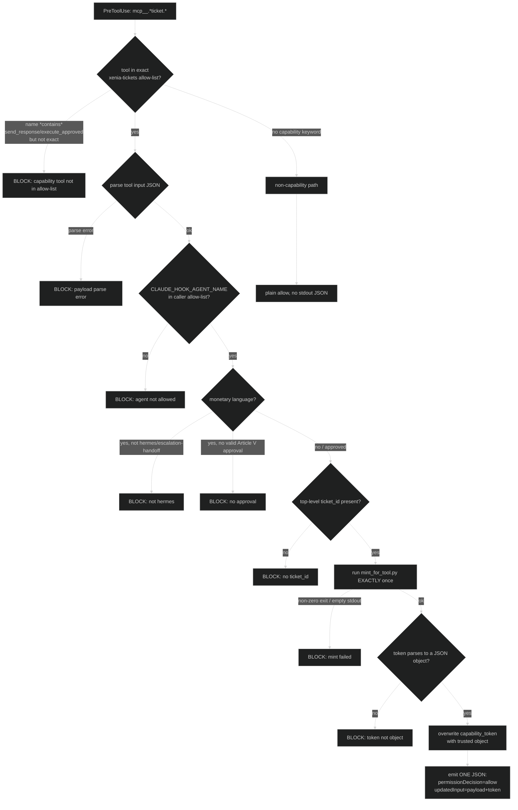

# Integration: WS-AUTH — Trusted Caller-Capability Tokens

How Xenia proves *which agent* is calling the irreversible ticket tools
(`send_response`, `execute_approved`) so the `xenia-tickets` MCP server can
trust an identity it did not have to take the caller's word for.

This is **WS-AUTH Phase 2** (commit `014191d` on the Xenia side; the Hydra
mint helper landed as `b5b5a2f`). Phase 1 instrumented the path; Phase 2
makes the `PreToolUse` hook *mint and inject* a cryptographically signed
caller-capability token, and the server *verify* it before acting.

> Do not confuse the two token families. WS-AUTH **caller-capability**
> tokens (this doc) prove the calling agent's identity and are signed with
> `HYDRA_OPERATOR_KEY`. **Clearance / portable-context** tokens (see
> [hydra.md](hydra.md#portable-context-token-signing)) prove that a customer-
> facing response body was cleared by the Themis → Eunomia pipeline and are
> signed with `XENIA_CONTEXT_SIGNING_KEY`. `send_response` requires BOTH.

---

## Why a token at all (the trust model)

The MCP `actor` argument is *self-reported* — any caller can put any slug in
it. Before WS-AUTH the server's actor allow-list was a "spoofable speed
bump." WS-AUTH replaces the self-reported `actor` with a **verified**
identity:

1. The framework (Claude Code) sets `CLAUDE_HOOK_AGENT_NAME` to the slug of
   the agent it is *actually* dispatching. The hook treats this — and only
   this — as the trusted identity. There is **no** `CLAUDE_AGENT_NAME`
   fallback, and there is no CLI flag or args field that can supply an
   identity.
2. The hook mints an HMAC-SHA256-signed token over that identity, bound to
   the exact `ticket_id`, with a short TTL and a single-use nonce.
3. The hook injects the token into the tool call (overwriting any
   agent-supplied `capability_token`).
4. The server verifies the signature, the bindings, and the nonce, then uses
   the **verified** `actor_id` from inside the token for the allow-list
   check — discarding the self-reported `actor` arg.

If any step cannot complete, the call is **blocked** (fail-closed). A missing
signing key is a hard failure, not a degraded soft-path.

---

## The minting helper (`mint_for_tool.py`)

The mint helper lives on the **Hydra** side, not in this repo:

```
Hydra/mcp_servers/xenia_tickets/mint_for_tool.py
```

Xenia's `tools/context_token/` holds only `sign.py` (the *clearance /
portable-context* signer). The caller-capability mint deliberately lives next
to the server that verifies it so the two share `hydra_core.auth.capability`.

Invocation (exactly what the hook runs):

```
python <Hydra>/mcp_servers/xenia_tickets/mint_for_tool.py \
    --tool-name xenia-tickets.send_response \
    --ticket-id 000123
```

`mint_token_for_tool()` has **no `actor_id` parameter** — by design. Identity
is read only from `os.environ["CLAUDE_HOOK_AGENT_NAME"]`. The fail-closed
paths (each returns nothing on stdout and exit 1):

| Condition | Result |
|---|---|
| `CLAUDE_HOOK_AGENT_NAME` unset/empty | `IDENTITY_UNSET` → no token |
| `--tool-name` not in the capability table | `UNKNOWN_TOOL` → no token |
| `--ticket-id` empty | `EMPTY_TICKET_ID` → no token |
| `HYDRA_OPERATOR_KEY` unset/empty | `KEY_ABSENT` → no token (no degraded token) |
| `mint_caller_capability` raises | `MINT_EXCEPTION type=<Name>` → no token |
| minted token is degraded (`sig.value` null) | `DEGRADED_TOKEN` → no token |

The capability table maps **only** canonical `xenia-tickets` tool names to a
capability string:

| Tool name (any registration form) | Capability |
|---|---|
| `xenia-tickets.send_response` / `mcp__xenia-tickets__send_response` / underscore variants | `xenia.send_response` |
| `xenia-tickets.execute_approved` / `mcp__xenia-tickets__execute_approved` / underscore variants | `xenia.execute_approved` |

A foreign tool whose name merely *ends in* `send_response` (e.g.
`mcp__evil__send_response`, bare `send_response`) is **not** in the table and
gets `UNKNOWN_TOOL` → fail-closed.

The minted token payload (signed by `hydra_core.auth.capability.mint_capability`):

```json
{
  "v": 1,
  "actor_id": "hermes",
  "actor_kind": "agent",
  "capability": "xenia.send_response",
  "resource_id": "000123",
  "workflow_id": "000123",
  "issued_at": 1718200000,
  "exp": 1718200120,
  "jti": "<auto-generated 16-byte hex nonce>",
  "sig": {
    "alg": "HMAC-SHA256",
    "key_id": "default",
    "value": "<base64url-nopad HMAC-SHA256 over canonical JSON minus sig>"
  }
}
```

`resource_id` and `workflow_id` are both bound to the `ticket_id`
(cross-workflow replay prevention). TTL is 120 s (short-lived, single-use).

---

## The hook: mint → inject (`pre-tool-privilege`)

`hooks.json` wires `pre-tool-privilege.ps1` (Windows) and
`pre-tool-privilege.sh` (POSIX) on the matcher `mcp__.*ticket.*`. Both
scripts are byte-for-byte behavioural mirrors; a deployment runs one set per
platform (never both — though `hooks.json` lists both command lines, each
no-ops on the wrong OS).

Stage flow inside the hook:



Hook invariants (verified in both `.ps1` and `.sh`):

- Identity from `CLAUDE_HOOK_AGENT_NAME` **only**, lowercased + trimmed.
- `ticket_id` from the **top-level** JSON `ticket_id` field only — no regex
  fallback over the raw payload.
- `mint_for_tool.py` is invoked **exactly once** (a single `Start-Process` /
  single `python3` call), via separated stdout/stderr temp files.
- The agent-supplied `capability_token`, if any, is **overwritten** with the
  trusted minted object — never merged or trusted.
- STDOUT is **exactly one** JSON object (`permissionDecision` +
  `updatedInput`). All logging and audit goes to STDERR.
- Audit lines carry a fixed decision code and a UTC timestamp **only** — no
  agent slug, ticket id, action word, filename, mint exit code, or payload
  content (anti-exfiltration).

Hook caller allow-list (Rule 1, identical in both scripts):
`iris`, `intake-router`, `soteria`, `retention-success`, `hermes`,
`escalation-handoff`. Monetary/irreversible actions additionally require the
agent to be `hermes` or `escalation-handoff` **and** a valid, unexpired
Article V approval artifact under `hearth/approvals/`.

Environment consumed by the hook: `CLAUDE_HOOK_AGENT_NAME`,
`CLAUDE_HOOK_TOOL_INPUT`, `CLAUDE_HOOK_TOOL_NAME`, `XENIA_ROOT`,
`HYDRA_ROOT`, `HYDRA_OPERATOR_KEY` (the last is read by the mint subprocess
and is never echoed).

---

## Server-side verification (`xenia-tickets`)

`send_response` and `execute_approved` enforce the token **first**, before
any other check, fail-closed. The server uses
`hydra_core.auth.capability.verify_capability` with the expected bindings:

```python
cap_result = verify_capability(
    capability_token,
    expected_capability="xenia.send_response",   # or xenia.execute_approved
    expected_actor_kind="agent",
    expected_resource_id=ticket_id,
    expected_workflow_id=ticket_id,
    now=int(time.time()),
)
```

Rejection paths (all return a typed error and refuse the action):

| Failure | Server error code |
|---|---|
| `capability_token` absent | `CALLER_CAPABILITY_INVALID` |
| not a JSON object / parse error | `CALLER_CAPABILITY_INVALID` |
| `HYDRA_OPERATOR_KEY` unset (no verify key) | `CALLER_CAPABILITY_INVALID` |
| degraded token (`sig.value` null) | `CALLER_CAPABILITY_INVALID` |
| signature mismatch | `CALLER_CAPABILITY_INVALID` |
| expired (`now >= exp`) | `CALLER_CAPABILITY_INVALID` |
| capability / actor_kind / resource_id / workflow_id mismatch | `CALLER_CAPABILITY_INVALID` |
| `jti` missing | `CALLER_CAPABILITY_INVALID` |
| `jti` already consumed (replay) | `CALLER_CAPABILITY_REPLAY` |
| verified `actor_id` not on tool allow-list | `FORBIDDEN_ACTOR` |

Single-use is enforced by a file-backed SQLite store
(`hearth/tasks/.caller_jti.db`, table `consumed_caller_capabilities`). An
`INSERT OR IGNORE` on the verified `jti` atomically marks it consumed; a
0-row result means replay → `CALLER_CAPABILITY_REPLAY`.

The verified `actor_id` then governs the actor allow-list. For both
`send_response` and `execute_approved` the allow-list is
`{hermes, escalation-handoff}` — there is **no** `human` role (a human
reviewer acts through Hermes). The verified identity, not the self-reported
`actor` arg, is what is written into the ticket `history`.

For `execute_approved`, the audit record distinguishes two identities:
`actor` = the cryptographically verified executor (from the token), and
`issued_by` = the human/process named on the Article V approval artifact that
authorised the action.

---

## End-to-end sequence

```mermaid
%%{init: {'theme':'dark'}}%%
sequenceDiagram
    participant Ag as Agent (Hermes)
    participant Hook as pre-tool-privilege hook
    participant Mint as mint_for_tool.py (Hydra)
    participant Srv as xenia-tickets server
    participant JTI as .caller_jti.db

    Ag->>Hook: call send_response{ticket_id, body, clearance_token}
    Note over Hook: identity = CLAUDE_HOOK_AGENT_NAME (trusted)
    Hook->>Mint: --tool-name ... --ticket-id 000123
    Note over Mint: actor_id from env only; sign w/ HYDRA_OPERATOR_KEY
    Mint-->>Hook: signed capability token (stdout) or exit 1
    Hook->>Hook: overwrite capability_token w/ trusted object
    Hook-->>Srv: updatedInput {..., capability_token}
    Srv->>Srv: verify_capability (sig, bindings, exp)
    Srv->>JTI: INSERT OR IGNORE jti
    JTI-->>Srv: 1 row (first use) / 0 rows (replay → BLOCK)
    Srv->>Srv: verified actor_id ∈ {hermes, escalation-handoff}?
    Srv->>Srv: clearance token + PII scan + Article V
    Srv-->>Ag: {ok:true} or typed error
```

---

## Degraded mode

If `HYDRA_OPERATOR_KEY` is unset, the mint helper refuses to emit a token
(no degraded token is ever produced), the hook blocks, and the server — even
if a token somehow reached it — rejects it. This is intentional: a
misconfigured operator key surfaces immediately as a hard block on
irreversible ticket actions, rather than silently waving an unsigned
"trust-looking" envelope through.

All other Xenia degraded modes (Hydra absent, TheEights absent, ticket
system absent) are unchanged; see [hydra.md](hydra.md) and the
[README](../README.md#degraded-modes).
