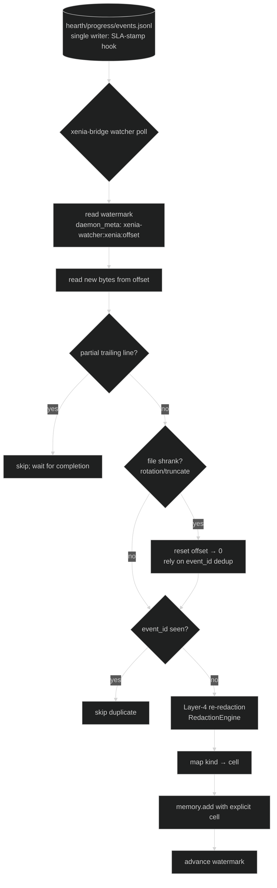

# Integration: TheEights

How Xenia's memory, events, and governed artifacts flow into TheEights
(the memory/governance substrate). Best-effort by design: TheEights
absent degrades to local files, never to failure.

## Identity

- `project_id: xenia`, registered via `eights.identity.register_project`
  (the daemon registers it in its known-projects loop).
- Memory domain: `customer-support`. Every op carries at least one scope
  tag: `project:xenia`, `ticket:<id>`, `severity:<P1-P4>`,
  `category:<intent>`, `customer:<hash>`, `outcome:delight`,
  `security:injection-finding`, `voc:<period>`.

## The event bridge (xenia-bridge in TheEights daemon)

- **Source of truth**: `hearth/progress/events.jsonl`, written ONLY by
  `.claude/hooks/post-output-sla-stamp.ps1` (single-writer rule).
- **Watcher**: polls the file with a byte-offset watermark
  (`daemon_meta` key `xenia-watcher:xenia:offset`); skips partial
  trailing lines; if the file shrinks (rotation/truncation) it resets to
  offset 0 and relies on **event_id dedupe** (`event_id` is unique:
  `x-<utc-ticks>-<hex4>`; the bridge skips events whose id it has
  already ingested).
- **Event schema** (stable contract — bump consciously):
  `{event_id, ts, kind, agent, phase, ticket_id, severity, category,
  path, sla_state, tokens, cost_usd, model_tier}` with `kind` in
  `xenia.ticket_created | xenia.ticket_resolved | xenia.escalated |
  xenia.voc_report | xenia.output_written`.
  The three cost fields (`tokens`, `cost_usd`, `model_tier`) are
  **nullable-additive** (prop_36000c5c, 2026-06-04): they are always
  present in the JSON object but may be `null` when the harness does not
  expose the corresponding env vars. The bridge ingests both the null and
  populated forms without change — no bridge update required.

## Watcher flow (offset → dedup → memory.add → cells)

The watcher never trusts hook-side redaction (Layers 1–3 may all have
failed); it re-redacts at Layer 4 before `memory.add`. `event_id`
(`x-<utc-ticks>-<hex4>`) is the idempotency key, so an offset reset after
rotation cannot double-ingest.

## Cell mapping (the trigram manifesto, compiled)

TheEights cells use English names; one cell per memory.

| Event kind | Cell(s) | Trigram reading |
|---|---|---|
| `xenia.ticket_created` | `risk` | Kan — the stranger arrives in trouble |
| `xenia.ticket_resolved` | `delight` | Dui — danger converted to joy |
| `xenia.escalated` | TWO memories: `risk` + `influence` | Kan + Xun — the crossing, and the context that crossed |
| `xenia.voc_report` | `influence` | Xun — the voice that returns |
| `xenia.output_written` | `influence` | default |

The bridge sets `cell` explicitly on `memory.add` (no keyword-classifier
dependence).

## Layer-4 redaction

The bridge re-redacts event content through TheEights' RedactionEngine
before `memory.add` — it does NOT trust hook-side redaction (Layers 1-3
may all have failed; constitution Article IV). `customer_ref` arrives as
an opaque hash already; the bridge validates rather than assumes.

## Resource registration (RSPL / evolution)

`eights.adapters.xenia.register_now` scans the pack into governed
resources with risk classes:

| Artifact | Kind | Risk | Evolution policy |
|---|---|---|---|
| `.claude/agents/**.md` | agent | high | hitl-only |
| `.claude/skills/**/SKILL.md` | skill | low | auto-commit eligible |
| `.claude/commands/**.md` | command | medium | evaluated |
| `rubrics/*.yaml` | rubric | low | auto-commit eligible |
| `squad.yaml` | squad | high | hitl-only |
| `.claude/hooks/*.ps1` | hook | critical/medium | hitl-only |

All changes flow propose → evaluate → commit/HITL through TheEights'
evolution engine; the constitution
(`hearth/specs/support-constitution.md`) is the frozen resource — never
evolved by agents.

## Adapter tools

`eights.adapters.xenia.start | stop | sync_now | register_now`, mirroring
the pp/rlm adapters. Root override: `EIGHTS_XENIA_ROOT`.

## Degraded mode (TheEights absent)

Recall returns empty → cold-start flag, proceed. Remember skipped with an
audit note. `events.jsonl` keeps accumulating locally; the watcher
backfills from the watermark on reconnection — nothing is lost, nothing
blocks.
