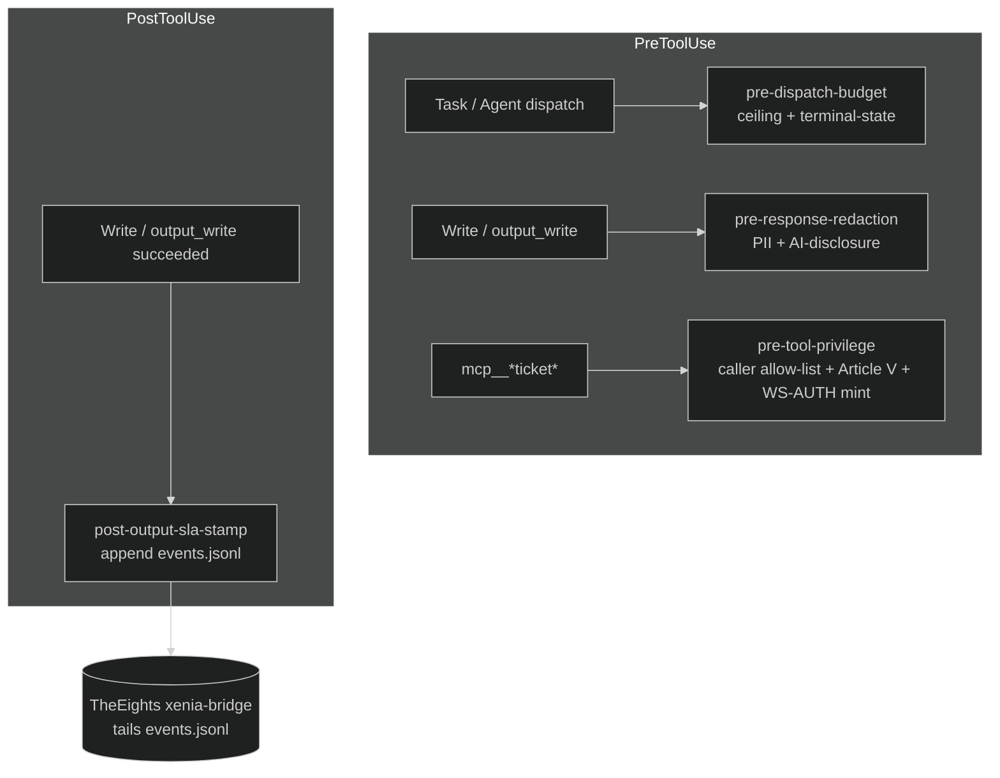

# Integration: Hooks (Layer-3 enforcement)

Xenia ships **four** hook stages, each in a Windows (`.ps1`) and POSIX
(`.sh`) flavour. They are the constitution's Layer 3 — mechanical
defense-in-depth that runs regardless of what the agents in context decided.
They are registered in [`hooks.json`](../hooks.json).

> Platform rule: a deployment runs EITHER the `.ps1` set OR the `.sh` set,
> never both. `hooks.json` lists `powershell -File ...` for every stage and
> additionally `bash ...` for `pre-tool-privilege`; each command no-ops on
> the wrong OS. The single-writer rule for `events.jsonl` (the SLA-stamp
> stage) applies per active platform.

## Stage summary

| Stage | Event | Matcher | Exit 2 = | Fail posture |
|---|---|---|---|---|
| `pre-dispatch-budget` | PreToolUse | `Task\|Agent` | block dispatch | **fail-open** (allow on internal error) |
| `pre-response-redaction` | PreToolUse | `Write\|mcp__.*xenia.*output_write` | block write | **fail-closed** (PII / disclosure gate) |
| `pre-tool-privilege` | PreToolUse | `mcp__.*ticket.*` | block ticket call | **fail-closed** + WS-AUTH mint |
| `post-output-sla-stamp` | PostToolUse | `Write\|mcp__.*xenia.*output_write` | n/a (always exit 0) | non-blocking telemetry |

Exit-code convention across all stages: `0` = allow, `2` = block (Claude Code
hard-refusal; Hydra logs a `GATE_BLOCK`). No stage exits `1`.



---

## 1. pre-dispatch-budget (fail-open)

Runtime per-run subagent-dispatch counter — a backstop against spin loops.
Counter file: `hearth/progress/.budget-<run_id>.json` with fields
`{run_id, command, ceiling, count, terminal, last_ts}`.

Ceiling table (mirrors `loop-budget-control` SKILL.md):

| Command | Ceiling (dispatches) |
|---|---|
| `support-ticket` | 8 |
| `triage-queue` | 25 |
| `support-shadow` | 10 |
| (default) | 8 |

- **Absorbing terminal state**: once the counter carries `terminal: true`,
  every further dispatch for that `run_id` is blocked (exit 2) regardless of
  count. New information after a terminal state = a new ticket
  (`FOLLOW_UP_TICKET`), per constitution Article VIII.
- **Ceiling check** is pre-increment: a ceiling of N allows dispatches 1..N;
  dispatch N+1 blocks (exit 2) with an escalate-to-human reason.
- **Fail-open**: any internal error (unwritable dir, JSON parse failure,
  mkdir failure) logs to stderr and exits 0. A counter outage must never
  block legitimate support work; the constitution + Stop-hook layers remain.

Env: `CLAUDE_HOOK_RUN_ID` (else a per-UTC-day fallback), `CLAUDE_HOOK_COMMAND`
(for the ceiling lookup), `XENIA_ROOT`.

---

## 2. pre-response-redaction (fail-closed)

PII + AI-disclosure gate on outbound writes. Parses `file_path`/`path` and
`content`/`body`/`new_string` from `CLAUDE_HOOK_TOOL_INPUT`.

- **PII scan** (email, SSN, payment card with 13–16-digit length check,
  phone, API-key/credential patterns). A real finding **blocks** (exit 2)
  unless the body carries an Eunomia clearance marker
  (`eunomia-cleared` / `clearance: cleared` / `seal: cleared`). Typed
  placeholders (`[EMAIL]`, `[PHONE]`, …) and opaque `customer:<hash>` refs
  are suppressed, not flagged. (Constitution Article IV — redaction at every
  boundary; no single layer trusted alone.)
- **AI-disclosure**: customer-facing bodies (path under
  `hearth/output/tickets/` or `escalations/`) must carry the
  `[AI-assisted response]` marker, else block (exit 2). (Article III.)

Env: `CLAUDE_HOOK_AGENT_NAME` (fallback `CLAUDE_AGENT_NAME`),
`CLAUDE_HOOK_TOOL_INPUT`. Emits one audit line to stdout; refusal reason to
stderr on block.

---

## 3. pre-tool-privilege (fail-closed + WS-AUTH mint)

Least-privilege gate on the ticket bridge, **and** the WS-AUTH Phase-2
caller-capability mint/inject point. Full treatment in [auth.md](auth.md);
the privilege rules:

1. **Caller allow-list** (Rule 1): only `iris`, `intake-router`, `soteria`,
   `retention-success`, `hermes`, `escalation-handoff` (identity from
   `CLAUDE_HOOK_AGENT_NAME` only, lowercased + trimmed). Anyone else → block.
2. **Monetary / irreversible actions** (Rule 2, Article V deny-by-default):
   only `hermes` / `escalation-handoff` may carry them, and only with a
   valid, unexpired, action-matching approval artifact under
   `hearth/approvals/` (`APPROVAL-*.yaml`, `status: approved`). Else block.
3. **WS-AUTH mint/inject**: for the exact tools `send_response` /
   `execute_approved`, mint a signed caller-capability token via Hydra's
   `mint_for_tool.py` and overwrite `capability_token` in the tool input.

Note the asymmetric `.ps1`/`.sh` wiring in `hooks.json`: this is the only
stage that lists **both** a PowerShell and a Bash command line. The two
scripts are byte-for-byte behavioural mirrors (same allow-list, same exact
capability-tool table, same exit codes, same fixed audit codes). Audit lines
carry a UTC timestamp + fixed decision code only — never a slug, ticket id,
action word, filename, or payload content (anti-exfiltration).

Env: `CLAUDE_HOOK_AGENT_NAME`, `CLAUDE_HOOK_TOOL_INPUT`,
`CLAUDE_HOOK_TOOL_NAME`, `XENIA_ROOT`, `HYDRA_ROOT`, `HYDRA_OPERATOR_KEY`.

---

## 4. post-output-sla-stamp (non-blocking telemetry)

The **single writer** of `hearth/progress/events.jsonl`. After a successful
write under `hearth/output/**`, appends exactly one event line. Always exits
0 — a telemetry outage can never block customer work; failures degrade
silently to stderr.

Event schema (the stable contract consumed by the TheEights `xenia-bridge`;
see [eights.md](eights.md)):

```
event_id     x-<epoch-ns>-<hex4>            (unique; dedup key)
ts           ISO-8601 UTC
kind         xenia.ticket_created | xenia.ticket_resolved |
             xenia.escalated | xenia.voc_report | xenia.output_written
agent        calling agent slug
phase        tickets | escalations | voc | quality | kb-gaps | other
ticket_id    parsed from path/body, else null
severity     P1..P4 | unknown
category     intent label | general
customer_ref customer:<hash> | null
outcome      delight | resolved | null
path         pack-relative output path
sla_state    ok | warn | breach | n/a
tokens       {"in":<int>,"out":<int>} | null
cost_usd     <number> | null
model_tier   opus | sonnet | haiku | null
```

The three cost fields (`tokens`, `cost_usd`, `model_tier`) are
nullable-additive: always present in the JSON, `null` when the harness does
not expose the matching env vars (`CLAUDE_HOOK_TOKENS_IN/OUT`,
`CLAUDE_HOOK_COST_USD`, `CLAUDE_HOOK_MODEL_TIER`).

---

## ps1 / sh parity

Both flavours of every stage implement identical logic, exit codes, and audit
formats. The POSIX scripts use only the POSIX baseline (`sh`, `grep`, `sed`,
`date`, `printf`, `mkdir`, `awk` for arithmetic; `python3` is used only by
`pre-tool-privilege` for JSON-safe parsing and the WS-AUTH mint envelope) —
no `jq` dependency. The `pre-tool-privilege` pair carries the most explicit
parity contract (`Fix A`/`Fix B`/`Fix C` comments) because it is the only
stage that mints a signed security token.
